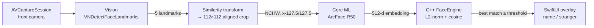
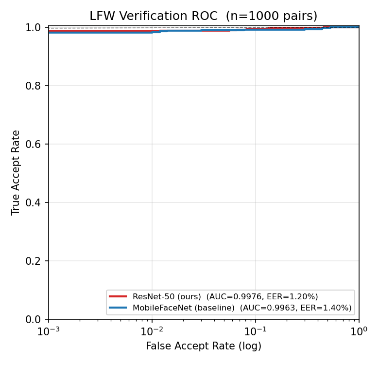
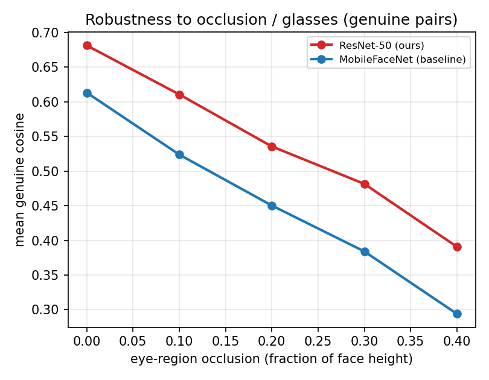

<div align="center">

# FaceID — On-Device Face Recognition for iOS

**Real-time face enrollment & recognition that runs entirely on the device — powered by a custom ArcFace model trained from scratch on 16× NVIDIA H200.**

[](https://developer.apple.com/ios/)
[](https://swift.org)
[](https://developer.apple.com/machine-learning/core-ml/)
[](FaceID/FaceEngine.hpp)
[](LICENSE)

<!-- TODO(demo): 录一段真机演示导出成 GIF 放到 docs/demo.gif -->


</div>

---

## What it is

FaceID points the front camera at a face, decides **whether that person is already in a local database**, and draws a green box + name when it recognizes them (red "stranger" otherwise). Everything — detection, alignment, embedding, matching — runs **on-device**; no network, no cloud, no data leaves the phone.

What makes this more than a wrapper around a pretrained model:

- **The recognition model is trained from scratch.** A ResNet-50 ArcFace backbone trained on Glint360K (360K identities, 17M images) on a 16-GPU H200 cluster, with a **custom augmentation pipeline specifically targeting the two failure modes that break naive face apps: glasses/occlusion and scale changes** (enroll close-up, recognize far away).
- **Clean, reusable architecture.** The UI/camera/detection layer is Swift; the matching engine is **pure C++17** behind a thin Objective-C++ bridge, so the same engine can be reused on Android or a desktop CLI without change.
- **Geometric face alignment**, not just a bounding-box crop — a closed-form similarity transform maps 5 facial landmarks onto the ArcFace template, which is what makes embeddings stable across pose and distance.

## Features

| | |
|---|---|
| 🎯 Real-time recognition | Front-camera live preview, ~7 fps recognition pipeline, green/red boxes + name + score |
| 🧬 5-point alignment | Vision landmarks → closed-form similarity transform → 112×112 ArcFace template |
| 🧠 Self-trained ArcFace R50 | 512-d embeddings, fp16 Core ML, runs on the Neural Engine |
| 💾 On-device enrollment | Tap to enroll a face under a name; persisted locally, survives relaunch |
| 🎚️ Tunable threshold | Live cosine-similarity threshold slider for FAR/FRR trade-off |
| 🔒 Fully offline | No network calls; embeddings + database never leave the device |

## How it works



1. **Capture** — `AVCaptureSession` with the front camera; orientation handled by `AVCaptureDevice.RotationCoordinator` so preview and analysis frames agree in any device rotation.
2. **Detect** — `VNDetectFaceLandmarksRequest` returns a bounding box and facial landmarks per frame (throttled to ~7 fps).
3. **Align** — 5 points (eyes, nose, mouth corners) are mapped onto ArcFace's canonical template via a **closed-form least-squares similarity transform** (no SVD). Alignment is the single biggest lever for cross-pose / cross-distance stability.
4. **Embed** — the aligned 112×112 RGB crop is normalized `(x − 127.5)/127.5`, fed NCHW into the Core ML ArcFace R50 model, out comes a 512-d vector.
5. **Match** — the pure-C++ `FaceEngine` L2-normalizes the vector and compares it against every enrolled identity by cosine similarity; the best score ≥ threshold wins.

## Architecture

```
┌──────────────────────────── Swift / SwiftUI ────────────────────────────┐
│  ContentView         camera preview · boxes · enroll UI · threshold      │
│  CameraModel         AVFoundation + Vision detection + alignment points   │
│  FaceEmbedder        Core ML ArcFace R50  (align → preprocess → infer)    │
│  CameraPreview       AVCaptureVideoPreviewLayer bridge                    │
└──────────────────────────────────┬──────────────────────────────────────┘
                                    │  Objective-C++ bridge
┌──────────────────────────────────▼──────────────────────────────────────┐
│  FaceEngineBridge (.mm)   ObjC++ wrapper, [Float] ⇆ std::vector<float>    │
│  FaceEngine (.cpp/.hpp)   PURE C++17 — L2-norm, cosine, file persistence, │
│                           std::mutex thread-safety. No Apple dependency.  │
└───────────────────────────────────────────────────────────────────────── ┘
```

The C++ core has **zero Apple dependencies** — that's deliberate. See [`training/`](training/) for how the model was made and [`tools/`](tools/) for the export pipeline.

## Build & run

> Requires a **physical iOS device** (the recognition pipeline needs a real camera) running iOS 18.5+, **Xcode 16.4+**, and **Git LFS** (the Core ML weights are stored in LFS).

```bash
# 1. Clone WITH the model weights (Git LFS)
git lfs install
git clone <repo-url>
cd FaceID
git lfs pull                       # fetches ArcFaceR50.mlpackage weight.bin (~87 MB)

# 2. Open & sign
open FaceID.xcodeproj
#   - select the FaceID target → Signing & Capabilities → set your Team
#   - pick your connected device as the run destination

# 3. Run (⌘R)
```

First launch asks for camera permission. Then: point at a face, tap **录入当前人脸 / Enroll**, give it a name. Point at the same person again → green box. ⚠️ Because the model defines the embedding space, **if you ever swap the model you must clear the database (🗑) and re-enroll.**

## Project structure

```
FaceID/
├── FaceID/                      # iOS app
│   ├── ContentView.swift            UI: preview, overlays, enroll, threshold
│   ├── CameraModel.swift            camera + Vision detection + landmark extraction
│   ├── CameraPreview.swift          preview layer bridge
│   ├── FaceEmbedder.swift           Core ML ArcFace: alignment + preprocess + inference
│   ├── FaceEngine.{hpp,cpp}         pure C++17 matching engine
│   ├── FaceEngineBridge.{h,mm}      Objective-C++ bridge
│   ├── FaceID-Bridging-Header.h
│   └── ArcFaceR50.mlpackage         trained model (Git LFS)
├── tools/                       # ONNX → Core ML export
│   ├── onnx_to_coreml.py
│   └── EXPORT_RUNBOOK.md
├── training/                    # how the model was trained (H200, Glint360K)   ← see Track C
└── tools/eval/                  # quantitative evaluation (ROC, FAR/FRR)         ← see Track B
```

## The model

| | |
|---|---|
| Architecture | ResNet-50 backbone, ArcFace head (512-d) |
| Training data | Glint360K — 360,232 identities, 17M images |
| Loss | CosFace margin (1.0, 0.0, 0.4), PartialFC `sample_rate=0.2` |
| Schedule | 16 epochs, effective batch 4096, lr 0.3 cosine, 1-epoch warmup |
| Hardware | 4 nodes × 4× NVIDIA H200 (16 GPUs), SLURM + `torchrun` (c10d), ~37k img/s, **~2 h wall-clock** |
| Robustness aug | horizontal flip · Gaussian blur · **downscale→upscale (small-face)** · color jitter · **random erasing (glasses/occlusion)** |
| Export | PyTorch → ONNX → Core ML fp16, output cosine vs. PyTorch reference **0.9984** |

Full recipe, augmentation rationale, and one-command reproduction in [`training/`](training/).

## Evaluation

Measured on **LFW** verification (1000 pairs), with faces detected and 5-point aligned using the
**same template the app uses**, embeddings from the exported ONNX (≡ shipped fp16 Core ML, cosine
0.9984). Full report + plots: [`tools/eval/RESULTS.md`](tools/eval/results/RESULTS.md) — reproduce
with `python tools/eval/evaluate.py`.

| Model | AUC | EER | Acc | genuine cos | impostor cos |
|---|---|---|---|---|---|
| MobileFaceNet (baseline) | 0.9963 | 1.40% | 99.10% | 0.613 ± 0.130 | 0.004 ± 0.069 |
| **ResNet-50 (ours)** | **0.9976** | **1.20%** | **99.30%** | **0.681 ± 0.123** | **−0.002 ± 0.054** |

The self-trained model wins across the board and, crucially, **holds up better under the two
failure modes it was trained for**. Under simulated eye-region occlusion (glasses/mask proxy) its
advantage over the baseline *grows* with severity:

| genuine cosine @ occlusion | 0% | 10% | 20% | 30% | 40% |
|---|---|---|---|---|---|
| MobileFaceNet | 0.613 | 0.524 | 0.450 | 0.384 | 0.294 |
| **ResNet-50 (ours)** | **0.681** | **0.611** | **0.536** | **0.482** | **0.391** |

<p align="center"> </p>

> LFW's EER threshold sits near 0.19; the app defaults to a more conservative **0.35** (in-the-wild
> glasses/pose lower genuine scores) with a live slider to retune. Stranger scores cluster at ≈0,
> leaving comfortable margin.

## Roadmap

- [ ] Multi-shot enrollment (average several frames per identity)
- [ ] Per-identity management (rename / delete a single person)
- [ ] Enrollment quality gate (reject blurry / extreme-pose / tiny faces)
- [ ] Temporal label smoothing (vote across frames)
- [ ] Passive liveness / anti-spoofing (blink detection)
- [ ] C++ engine unit tests + standalone CLI (cross-platform proof)

## Tech stack

`Swift 6` · `SwiftUI` · `AVFoundation` · `Vision` · `Core ML` · `C++17` · `Objective-C++` · `PyTorch` · `InsightFace / arcface_torch` · `coremltools`

## Acknowledgements

- [InsightFace](https://github.com/deepinsight/insightface) — `arcface_torch` training recipe and the ArcFace/Glint360K line of work.
- Apple Vision & Core ML.

## License

[MIT](LICENSE). See the note there regarding the trained model weights and upstream dataset/recipe licenses.
